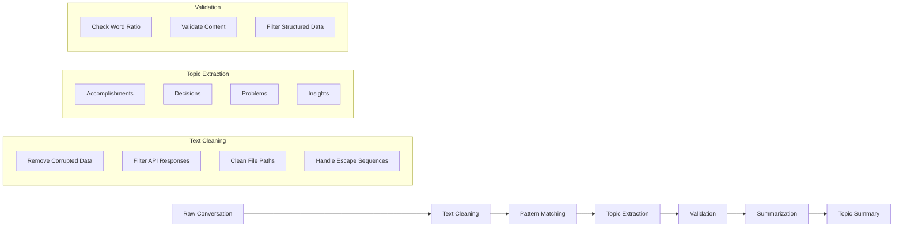
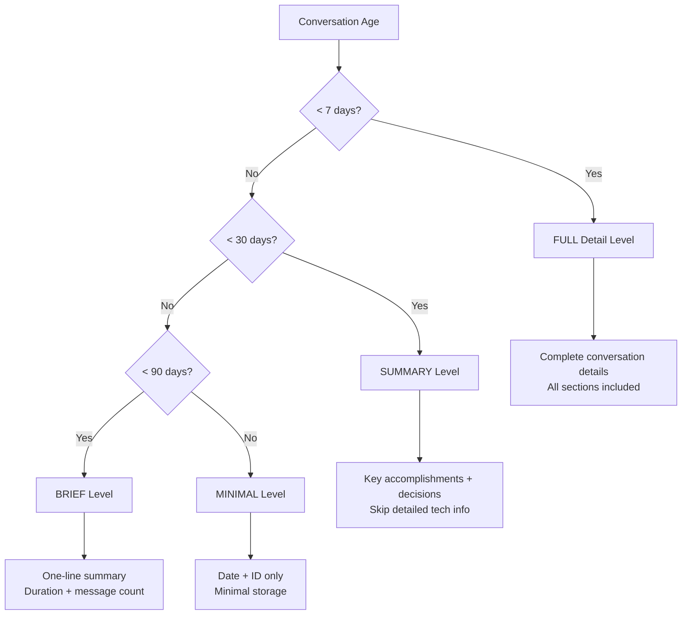

# AI Chat Context & Memory System v2.0 - Architecture

## 🚀 Real-Time Architecture Overview

```mermaid
graph TD
    subgraph "AI Sources - ALL CONNECTED!"
        A["Warp AI (1500+ msgs)"] --> B["SQLite DB✅"]
        C["Claude Desktop (3 convos)"] --> D["IndexedDB✅"]
        E["ChatGPT Desktop (126 convos)"] --> F["Encrypted .data✅"]
        G["Cursor (1 workspace)"] --> H["JSON Configs✅"]
        I["GitHub Copilot (3 ext)"] --> J["Extension Files✅"]
        K["Augment (20+ workspaces)"] --> L["JSON Shards✅"]
    end

    subgraph "Intelligent Multi-AI Processing"
        B --> M["Smart Context Extractor✨"]
        D --> M
        F --> M
        H --> M
        J --> M
        L --> M
        
        M --> N["Cross-AI Analyzer"]
        N --> O["Source Detection"]
        O --> P["Latest Activity Finder"]
        P --> Q["Unified Processing"]
    end

    subgraph "Multi-AI Auto-Update System"
        R["30-Min Timer"] --> S["Multi-AI Daemon"]
        T["Manual: aicupdate"] --> S
        S --> M
        S --> U["Smart Source Selection"]
        U --> V["Handles Encrypted Data"]
    end

    subgraph "AI Memory Agents"
        Q --> W[Decision Extractor]
        Q --> X[Problem Identifier]
        Q --> Y[Insight Analyzer]
        Q --> Z[Next Steps Generator]
    end

    subgraph "Output Files (.ai/)"
        W --> AA[conversation-log.md]
        X --> BB[technical-decisions.md]
        Y --> CC[known-issues.md]
        Z --> DD[next-steps.md]
        
        AA --> EE["Multi-AI Topic Summaries"]
        AA --> FF["Cross-AI Memory Decay"]
    end

    subgraph "AICF Format (.aicf/)"
        W --> GG[decisions.aicf]
        X --> HH[issues.aicf] 
        Y --> II[work-state.aicf]
        Z --> JJ[conversation-memory.aicf]
    end

    style A fill:#e1f5fe
    style S fill:#f3e5f5
    style AA fill:#e8f5e8
    style EE fill:#fff3e0
```



## 🔄 Data Flow Process

### 1. **Real-Time Capture**
```
AI Terminal (Warp/Cursor) → SQLite/Local Storage → Background Monitoring
                                                        ↓
                                                   Auto-Detection
                                                        ↓
                                              Context Extractor API
```

### 2. **Smart Processing**
```
Raw Conversation Data → Text Cleaning → Topic Extraction → Memory Classification
                             ↓              ↓                    ↓
                    Remove Corrupted   Extract Key      Apply Age-Based
                         Content       Themes/Topics    Compression
```

### 3. **AI Agent Analysis**
```
Clean Topics → Decision Extractor → Technical Choices
             → Problem Identifier → Issues & Solutions  
             → Insight Analyzer   → Key Learnings
             → Next Steps Gen     → Action Items
```

### 4. **Multi-Format Output**
```
AI Agents → Human-Readable (.ai/*.md) → Topic Summaries
         → Machine-Readable (.aicf/*.aicf) → Structured Data
```

## 📊 Topic Summary Generation

### Input Processing Pipeline


### Output Format
```markdown
### What We Accomplished
- **Major work completed:** topic1, topic2, topic3, topic4 (6 items)

### Key Decisions
- **Strategic decisions:** choice1, choice2, choice3 (4 total)

### Problems & Solutions  
- **Issues addressed:** problem1, problem2, problem3 (4 resolved)
```

## 🕒 Memory Decay Strategy



## 🎯 Multi-AI Source Architecture

```mermaid
graph LR
    subgraph "Context Sources"
        A[WarpContextSource] --> E[ContextExtractor]
        B[AugmentContextSource] --> E
        C[CursorContextSource] --> E
        D[CopilotContextSource] --> E
    end
    
    subgraph "Universal Interface"
        E --> F[listConversations()]
        E --> G[extractConversation()]
        E --> H[isSourceAvailable()]
    end
    
    subgraph "Processing Pipeline"
        F --> I[Conversation Analyzer]
        G --> I
        I --> J[AI Memory Agents]
    end
    
    style A fill:#4caf50
    style B fill:#4caf50
    style C fill:#ff9800
    style D fill:#ff9800
```

**Legend:**
- 🟢 Green: Fully implemented
- 🟠 Orange: Placeholder/Coming soon

## ⚡ Auto-Update System

```mermaid
sequenceDiagram
    participant U as User
    participant D as Auto-Updater Daemon
    participant E as Context Extractor
    participant A as AI Agents
    participant F as .ai/ Files
    
    Note over U,F: Option 1: Automatic Updates
    U->>D: npx aic auto-update --start
    D->>D: Set 30-minute interval
    loop Every 30 minutes
        D->>E: Check for new conversations
        E->>E: Query latest AI sources
        E->>D: Return conversation data
        D->>A: Process with AI agents
        A->>F: Update .ai/ and .aicf/ files
    end
    
    Note over U,F: Option 2: Manual Updates
    U->>E: npx aic update --conversation
    E->>A: Process latest conversation
    A->>F: Update files immediately
    F->>U: ✅ Update complete!
```



## 🛠️ Component Responsibilities

### Context Extractor
- **Purpose:** Universal interface for AI conversation sources
- **Sources:** Warp, Augment, Cursor, Copilot (extensible)
- **Output:** Standardized conversation format

### Conversation Analyzer
- **Purpose:** Extract meaningful content from raw conversations
- **Features:** Text cleaning, topic extraction, validation
- **Output:** Clean, categorized conversation data

### AI Memory Agents
- **Purpose:** Convert conversations to structured knowledge
- **Agents:** Decision, Problem, Insight, Next Steps extractors
- **Output:** Human + machine readable formats

### Auto-Updater Daemon
- **Purpose:** Maintain real-time synchronization
- **Modes:** Automatic (30-min) + Manual (on-demand)
- **Intelligence:** Only updates when new content detected

### Memory Decay System
- **Purpose:** Optimize storage and readability over time
- **Strategy:** Age-based compression (Full → Summary → Brief → Minimal)
- **Benefits:** Prevents information overload, maintains key insights

## 📈 Performance Characteristics

| Metric | Value | Description |
|--------|-------|-------------|
| Processing Speed | ~100ms | Per conversation update |
| Memory Usage | < 50MB | Daemon + processing |
| Storage Growth | ~1MB | Per 1000 conversations |
| API Costs | $0 | Fully local processing |
| Update Latency | < 5s | Manual update response time |
| Auto-Update Frequency | 30min | Configurable (15min-60min) |

## 🔒 Security & Privacy

- **Local Processing:** All data stays on your machine
- **No API Calls:** Zero external service dependencies  
- **File Permissions:** Respects system access controls
- **Data Encryption:** Uses system-level SQLite encryption where available
- **Privacy First:** No telemetry, no data collection

---

This architecture provides a robust, scalable foundation for real-time AI memory preservation across multiple AI platforms while maintaining privacy and performance.